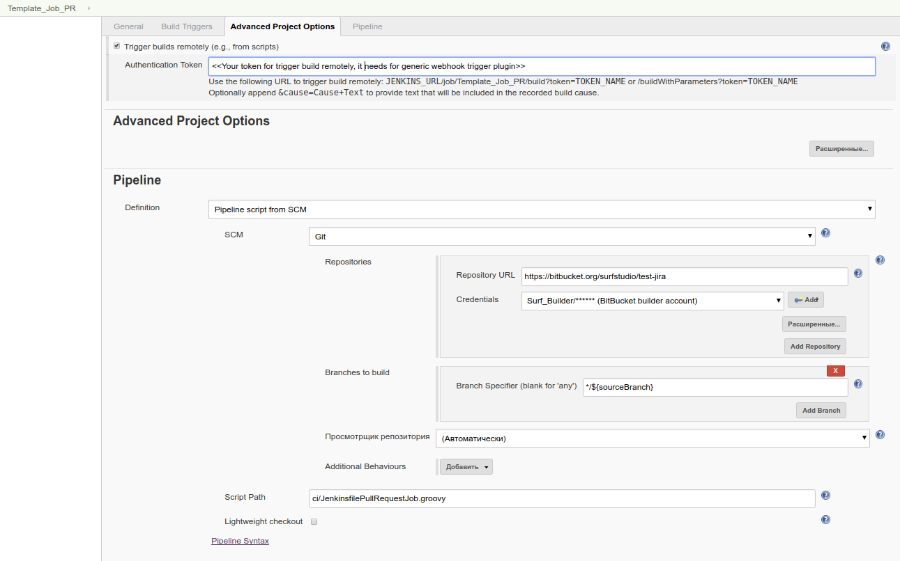

# jenkins-pipeline-lib
[Библиотека](https://jenkins.io/doc/book/pipeline/shared-libraries/) для pipeline скриптов дженкинса


 Наследники класса Pipeline - ключевые сущности для выполнения скрипта
 По сути знают что и как выполнять и определяют параметры выполнения
 
 * "как" определяется методом run (не нужно переопределять)
 * "что" определяется в методе init (нужно переопределять)
 * "параметры выполнения" определяются через публичные переменные
 
 Для создания собственного наследника необходимо переопределить метод init и в нем определенить переменные
 (любая из них может быть не проинициализирована):
 
 * **node**                  :  Машина, на которой будет выполняться основная работа(stages)
 * **stages**                :  Массив с обьектами определяющими блоки основной работы
 * **initializeBody**        :  Лямбда, котороая будет выполняться перед стартом основной работы на master машине
 * **finalizeBody**          :  Лямбда, которая будет выполняться после основной работы, как в случае успешного завершения, так и после ошибки
 * **propertiesProvider**    :  Лямбда, которая должна вернуть массив properties, например триггеры и параметры сборки
 * **preExecuteStageBody**   :  Лямбда, которая выполняется до выполнения Stage
 * **postExecuteStageBody**  :  Лямбда, которая выполняется после выполнения Stage

Предусмотрены различные способы кастомизации

 * изменение переменных, определяющих контекст
 * изменение стратегии/тела Stage (для получения следует использовать getStage())
 * замена целых Stage через метод replaceStage() или напрямую через переменную stages
 * все остальное, что может прийти в голову, так как все переменные публичные

 Большую часть деталей реализации следует размешать в классах ...Util для возможности переиспользования
 без механизмов класса Pipeline

Предусмотрен класс EmptyPipeline для полостью кастомных скриптов

Пример импользования:
```groovy
@Library('surf-lib@version-1.0.0-SNAPSHOT')
import ru.surfstudio.ci.pipeline.tag.TagPipelineAndroid
import ru.surfstudio.ci.stage.StageStrategy
import ru.surfstudio.ci.AndroidUtil

//init
def pipeline = new TagPipelineAndroid(this)
pipeline.init()

//customization
pipeline.buildGradleTask = "clean assembleQa"
pipeline.getStage(pipeline.STATIC_CODE_ANALYSIS).strategy = StageStrategy.SKIP_STAGE
pipeline.getStage(pipeline.INSTRUMENTATION_TEST).body = {
	AndroidUtil.onEmulator(this, "your avd") {
		sh "./gradlew connectedTest"
	}
}

//run
pipeline.run()
```

###Шаблоны
В папке templates находятся стандартные Jenkins скрипты для разных типов проектов (android, ios, ui_test)

#Разработка
Основными ветками являются ветки вида **version-X.Y.Z-SNAPSHOT**
Изменение библиотеки следует производить в feature-branch, чтобы не затронуть работающие проекты. Когда новая функциональность будет закончена, следует слить ветку с ней в master. 
Для тестирования изменений в пайплайн скрипте следует импортировать библиотеку следующим образом `@Library('surf-lib@feature-branch')`. Не забываем поддерживать обратную совместимость Api библиотеки.
###Инструменты
Для работы с библиотекой удобно использовать [IntelliJ IDEA](https://www.jetbrains.com/idea/) c установленным [Groovy](http://groovy-lang.org/install.html).
В ProjectStructure на вкладке Modules директорию "src" следует пометить как "Sources" 

#Кофигурация Jenkins
* Версия Jenkins <= 2.121.2
* nodes для Android сборок с меткой "android"
* nodes для iOS сборок с меткой "ios"
* ui test (todo)

### Необходимые плагины
* Blue Ocean
* Build Pipeline Plugin
* Pipeline
* Pipeline Utility Steps
* Generic Webhook Trigger
* Git plugin
* JUnit Attachments Plugin
* Poll SCM plugin
* [Bitbucket Build Status Notifier Plugin](https://github.com/surfstudio/bitbucket-build-status-notifier-plugin) surf fork

### Конфигурация Job
Для большинства случаев используются jeninsFile (см пакет templates), размещенные в репозитории с исходным кодом.
#### Пример начальной конфигурации Job для сборки PullRequest из BitBucket (остальная конфигурация применится из pipeline при первом старте job):


* Repository URL - репозиторий с jenkinsFile  
* Script Path - путь до jenkinsFile

Также необходим вебхук на события "Pull Request - Created: true; Updated: true" в Bitbucket c URL: http://jenkins.surfstudio.ru/generic-webhook-trigger/invoke?token=Your_token_for_trigger_build_remotely 


